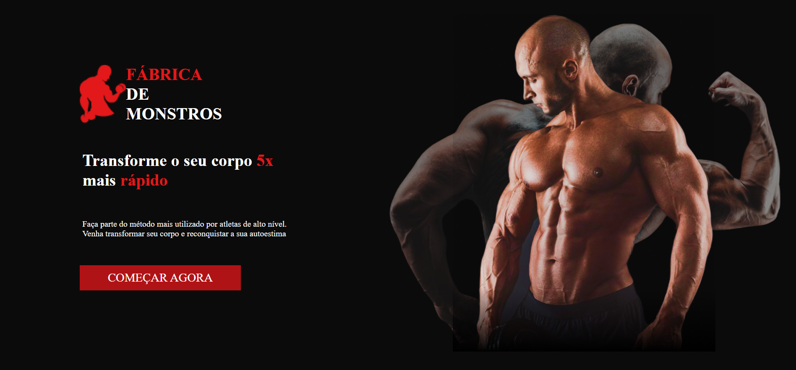

# Projeto Fabrica de Monstros

<div align="center">


</div>


Projeto que visa criar uma pagina de uma academia.

## Indice
- <a href="#Tecnológias-utilizadas"> Tecnológias utilizadas</a>
- <a href="#layout ">Layout </a>
- <a href="#demostração ">Demostração </a>
- <a href="#comorodaresseprojeto ">Como rodar esse projeto?</a>
- <a href="#tecnologiasutilizadas ">Tecnologias utilizadas</a>
- <a href="#pessoasautoras">Pessoas autoras</a>
- <a href="#proximospassos ">Proximos passos</a>

## 📱Fucionalidades do projeto

- O site tem apenas uma página: Home;
-  Projeto está seguindo esse <a href="https://www.figma.com/file/YQtNSfvAY36ch94ueKxhD0/F%C3%A1brica-de-Monstros?node-id=3%3A11&t=T04PiYgLm03BqssO-0" >desing</a>;


    ## 👀Layout



## Demonstração

[Link demonstração](https://loja-virtual-git-main-mathmendesreis.vercel.app/)

## Como rodar esse projeto?

```
# clone este repositorio
$ git clone https://github.com/MathMendesReis/loja-virtual.git

# Acesse a pasta do projeto no seu terminal
$  cd loja-virtual/

#instale as depedências
$ npm install

# Execute a aplicação
$ npm run start

# A aplicação sera iniciada na porta 300, 
acesse pelo navegador: http:http://localhost:3000
```

## Tecnologias utilizadas

1. [React js](https://reactjs.org/)
2. [Styled-components](https://styled-components.com/)

## Pessoas autoras


[Linkedin](https://fabricademonstros.surge.sh/)

## Proximos passos

-[ ] Torna o site responsivo
